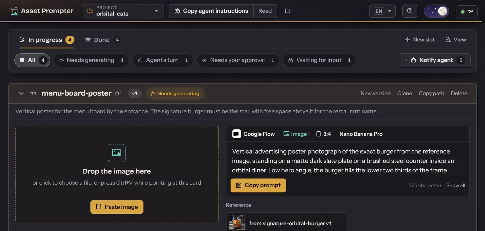
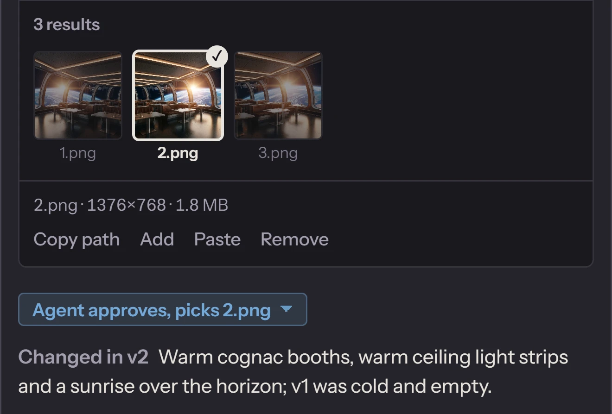

<p align="center">
  
</p>

<h1 align="center">Asset Prompter</h1>

<p align="center">
  Your coding agent asks for images and video.<br>
  You generate them by hand, in the tool you already pay for.<br>
  A folder carries everything in between.
</p>

<p align="center">
  <a href="https://assetprompter.com">Website</a> ·
  <a href="#install">Install</a> ·
  <a href="#how-it-works">How it works</a> ·
  <a href="#works-with">Works with</a> ·
  <a href="#what-your-agent-gets">For agents</a>
</p>

<p align="center">
  
  
  
  
</p>

<p align="center">
  
</p>

## The problem

Midjourney and Google Flow have no public API. Leonardo and Luma bill theirs separately from the plan you already pay for. So your agent knows exactly which pictures it needs, but it cannot press Generate, and you become the courier: copy the prompt out of the chat, paste it into the generator, download the result, rename it, move it into the repo, describe it back to the agent.

**Asset Prompter turns that into a loop you can run in minutes, or over days.** The agent writes prompt files into a project folder. You see them as cards in a local web app, copy each prompt into your generator and drop the result back onto the card. The agent sees every result, reviews it, and either approves it or writes the next version. You give the final word. Nothing leaves your machine except what you paste into the generator yourself.

## How it works

<p align="center">
  
</p>

One slot is one asset. Each slot goes through the same six steps, and a project can hold as many slots as you like, in any state.

| | Who | What happens |
| --- | --- | --- |
| 1 | **Agent** | Writes a request: what the asset is for, the prompt, and the generator settings (model, aspect ratio, length, references). |
| 2 | **You** | Press **Copy prompt**, generate in your tool, drop the result onto the card. Images and videos, one or several. |
| 3 | **Agent** | Reviews the result against the brief. For a video it reads frame sheets and a motion map. It approves, or writes version 2 with a better prompt. |
| 4 | **You** | Approve it, or type what to change. Your approval is final. |
| 5 | **Project** | The approved file lands as `final.png` or `final.mp4` in the slot, next to every version that led to it. The agent can add crops and other sizes in `exports/`. |
| 6 | **Notify agent** | One button wakes the agent with a briefing of everything that is now its turn. Or just tell it "done" in the chat. |

<p align="center">
  
</p>

The **Tutorial** button in the app walks through the whole loop with pictures of a real project. It opens by itself on the first visit.

## Works with

**Any generator** you can paste a prompt into and get a file out of. A preset tells the agent what a tool offers, so its requests fit the settings you can actually select, and the app warns you when a result does not match. Seven presets ship, checked in October 2026:

| Generator | Images | Video | Notes for the agent |
| --- | :---: | :---: | --- |
| &nbsp; **Midjourney** | V8.2, V8.1, V7, Niji 7 | V1, 5 s + extend to 21 s | Parameters go in the prompt (`--ar`, `--hd`, `--sref`); silent video |
| &nbsp; **Google Flow** | Nano Banana Pro / 2 / 2 Lite | Veo 3.1, Gemini Omni, 4–10 s | Frames, ingredients, extend; native sound |
| &nbsp; **Dreamina** | Seedream 5.0, GPT Image 2, Nano Banana | Seedance 2.5, 4–30 s | Up to 50 references, timestamps in the prompt, native sound |
| &nbsp; **Grok Imagine** | Image 2.0 | Imagine 1.5, up to 15 s, 1080p | Text, image and reference to video; native sound |
| &nbsp; **Leonardo.Ai** | Lucid, Phoenix, GPT Image, Nano Banana, Seedream, FLUX | Veo 3.1, Kling 3.0, Seedance, Hailuo, Motion 2.0 … | Many models, each with its own price on Generate |
| &nbsp; **Luma Dream Machine** | Uni-1.1, Photon | Ray3.2, 5 or 10 s, up to 1080p | 16 keyframes, HDR and EXR export; silent |
| &nbsp; **ChatGPT Images** | Images 2.5 | — | Best at text in pictures and precise edits |

Each slot names its own tool, so one project can mix them: a Midjourney still as the start frame of a Flow clip, for instance. Another tool needs only a short preset file, see [Presets](#presets).

**Any agent** that can read and write files and follow a written instruction: Claude Code, Codex, Cursor, Gemini CLI, GitHub Copilot, OpenCode, and the like. A chat window in a browser cannot. If the agent can also run a command in the background and be woken when it ends, **Notify agent** wakes it; if not, you tell it "done".

## Install

Nothing needs to be installed beforehand. Download the folder (**Code → Download ZIP** and unzip, or `git clone`), then run setup once. It installs what is missing, skips what you have, and is safe to run again:

| | |
| --- | --- |
| **Windows 10/11** | Double-click `setup.bat`. |
| **Linux** | Open a terminal in the folder and run `sh setup.sh`. It asks for your password to install ffmpeg. |
| **Let your agent do it** | Paste into a chat with a coding agent that can run commands: `Install Asset Prompter for me: follow https://github.com/Djordje1998/asset-prompter/blob/master/AGENT-INSTALL.md` |
| **By hand** (any OS with [Bun](https://bun.sh)) | `bun install` then `bun start`, or double-click `start.bat` / `start.sh`. |

Setup installs:

1. [Bun](https://bun.sh), which runs the app.
2. ffmpeg. The app works without it, but with it every dropped video gets frame sheets, a motion map, a first/last frame comparison and per-second motion numbers for the agent, and every result is checked against the length and aspect ratio its prompt asked for.
3. The app's packages.
4. An **Asset Prompter** icon on the Desktop and in the Start or app menu. It starts the server in the background, or just opens the browser if it is already running.

The app opens at **http://127.0.0.1:4777** and is reachable from this machine only.

### First use

1. Create a project in the app: a new folder in `projects/`. To keep one elsewhere, such as inside the repo your agent works in, add its full path to `externalProjects` in `config.json` and restart the app.
2. Press **Copy agent instructions** and paste it into a new chat with your agent. That is the only message it needs.
3. Generate what appears, drop the results, approve what you like. After each batch, press **Notify agent**.

## What your agent gets

The folder is the whole interface, so the agent needs no plugin, MCP server or API key.

- **`HOW-TO-USE.md`**, written into every project: the file layout, whose turn it is in every state, how to write a request and a review, and the settings every installed generator offers. The agent reads it once.
- **`info.md`** next to every batch of results: the size and length of each file, which inputs were attached, and anything that does not match the request, such as a 10 s clip where 8 s was asked.
- **For video**, with ffmpeg: one frame sheet per second (four frames 250 ms apart), a first/last frame comparison for loops, a motion map of what changed, and motion numbers per second, so the agent can judge a clip it cannot play.
- **Slot inputs**: a request can use another slot's approved result as its reference or start frame. The app holds it back until that result is approved, so nothing is generated from a draft.
- **A briefing on Notify agent**: every slot where it is now the agent's turn, your comments, each result with its size and any mismatch, and every slot you approved since the last briefing. The agent waits for it with one `curl` in the background.
- **`exports/`** in every approved slot, for the crops, sizes and formats the agent derives from the final file.

## The folder

A project is a folder. A slot is a subfolder: one asset. A version is a prompt file plus a folder of results. There is no database; the folder is the only source of truth, so it can live inside a repo and travel with it.

```
my-project/
  HOW-TO-USE.md          written by the app, read by the agent
  hero-banner/           one slot
    slot.md              what the asset is for
    v1.md                prompt and settings, version 1
    v1/                  your results for v1: 1.png, 2.png, info.md …
    v1.review.md         the agent's review of v1
    v1.feedback.md       your change request, if any
    v2.md                the next attempt
    APPROVED             names the approved version
    final.png            copy of the approved result
    exports/             variants the agent made from it
```

Everything the agent writes is a small Markdown file with YAML frontmatter, so it is easy to read, diff and version:

```markdown
---
tool: google-flow
type: video
model: Veo 3.1 - Fast
mode: frames
aspect_ratio: "16:9"
duration: 8s
inputs:
  - role: start_frame
    slot: hero-image
---

Slow push-in toward the cafe entrance at dusk. Rain on the cobblestones,
warm light in the windows. No people, no text.
```

## Settings

- **`config.json`**, created on first run: the port, the projects folder, folders added from elsewhere, and whether to open the browser.
- **`presets/`**: one file per generator, see below.

### Presets

`presets/<tool>.md` describes a generator: its models, the modes each one has and which input files a mode takes, lengths, resolutions, aspect ratios, how many references fit, a note per model, and notes for the agent. The picture next to it, `presets/<tool>.png` or `.svg`, is the logo on the cards.

```yaml
---
tool: my-tool
name: My Tool
checked: 2026-10-06
video:
  aspect_ratios: ["16:9", "9:16"]
  modes:
    frames: { roles: [start_frame, end_frame], about: "Image to video" }
    extend: { roles: [video], needs: video }
  models:
    - name: Clip 2
      modes: [frames, extend]
      durations: [5s, 10s]
      resolutions: [720p, 1080p]
---

- Notes the agent should know, such as how the tool takes a negative prompt.
```

The presets feed the Tools section of `HOW-TO-USE.md`, the choices in the New slot form and the warnings on cards. Tools change weekly: when yours differs, edit its file and restart the app; for a new tool, copy one. A mismatch is always a warning, never a block.

## Good to know

- **You press Generate, every time.** For batches that should run while you are away, pick a generator with an API or an MCP server instead.
- **The agent cannot hear.** Checking a clip's sound is your job; the agent's review tells you what to listen for.
- **Local only.** The server listens on 127.0.0.1, asks for no account and keeps everything in your project folder. Two things leave the machine: the interface loads its fonts from Google Fonts, and whatever you paste into your generator goes to that generator.
- **macOS** is not covered by setup; install Bun yourself and run `bun install` and `bun start`.
- **Deleting** a project, a slot or a result moves it to a `_trash` folder, and can be undone from the app.

## Development

```
bun dev     # the server with hot reload
bun test    # the test suite
```

`src/server` is the Bun server: it scans project folders, writes `HOW-TO-USE.md`, analyses media with ffmpeg and serves the API. `src/web` is the React app. `src/shared` holds the types both use. No build step: Bun bundles the page when the server starts.

---

<p align="center">
  <sub>The generators and agents named here belong to their owners. This project is not affiliated with any of them.</sub>
</p>
